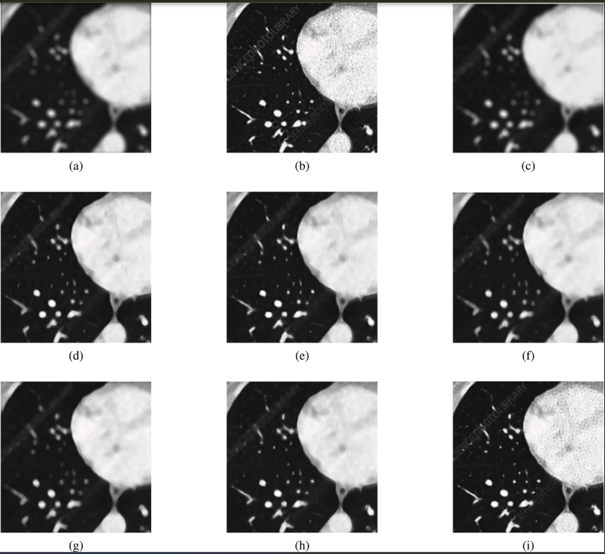
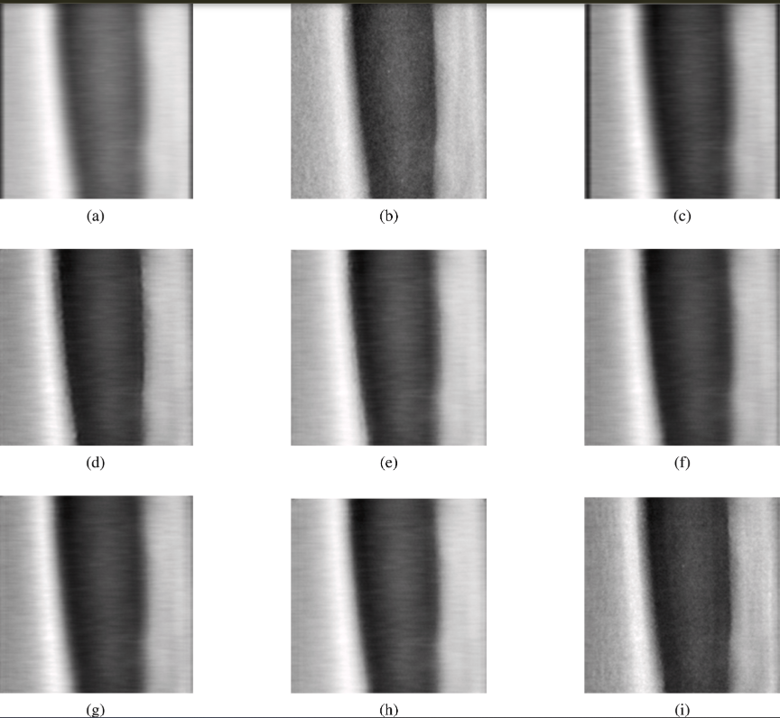
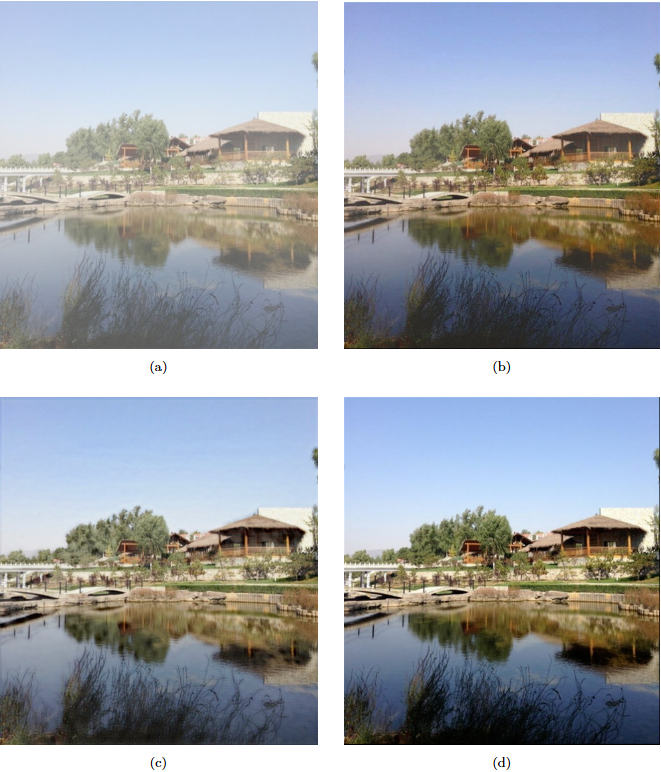

# Performance and Visual Gallery

The SAGA operator has been rigorously evaluated across multiple baseline architectures (VGGNet, ResNet, U-Net, EDSR) and state-of-the-art activation functions (Sigmoid, Tanh, ReLU, Swish, ELU, FReLU). 

Below is a curated summary of the visual performance, alongside exhaustive quantitative ablation studies and computational efficiency metrics.

## Visual Comparison: Best-in-Class Models

*SAGA selectively routes gradients to preserve fine anatomical boundaries while suppressing uniform background noise, outperforming standard parameterless and parametric activations.*

### Chest CT Deblurring (ResNet Backbone)

*(Visual comparison using ResNet on a representative Chest X-ray sample. (a) Blurry input, (b) Ground truth, (c) Sigmoid, (d) Tanh, (e) ReLU, (f) Swish, (g) ELU, (h) FReLU, (i) SAGA. Notice the structural preservation of the pulmonary and rib margins in the SAGA output).*

### Osteoporosis DXA Quality (ResNet Backbone)

*(Visual comparison using ResNet on a representative Osteoporosis X-ray sample. (a) Blurry input, (b) Ground truth, (c) Sigmoid, (d) Tanh, (e) ReLU, (f) Swish, (g) ELU, (h) FReLU, (i) SAGA. SAGA ensures that the high-frequency details of trabecular bone margins are maintained).*

---
---
 
## Natural Image Dehazing
 
SAGA transfers directly to the natural image dehazing domain. The only
modification to each dehazing architecture is replacing every intermediate
activation with `SAGA(in_channels=C)` — no other structural change is made.
Both models are trained on the
[RESIDE-6K dataset](https://www.kaggle.com/datasets/kmljts/reside-6k)
(4,500 training pairs; 1,000 test pairs).
 
### AOD-Net: ReLU vs SAGA
 

 
*(Dehazing comparison on representative RESIDE-6K test images. (a) hazy input, (b)  ReLU baseline output, (c) SAGA output, (d) ground truth. SAGA recovers finer structural
detail at object boundaries, while assigning near-zero gate values to uniform haze regions, suppressing artefacts in flat sky areas.)*
 
> **To reproduce these results**, see the training scripts in the
> [SAGA GitHub repository](https://github.com/sijuswamyresearch/SAGA).
> Both architectures require `pip install saga-activation` and a RESIDE-6K
> download. AOD-Net results are
> averaged over the full 1,000-image test set.
 
---
## Quantitative Benchmarks

### Medical image restoration

SAGA consistently yields the highest Peak Signal-to-Noise Ratio (PSNR) and Structural Similarity Index Measure (SSIM) across both clinical modalities and all network backbones, demonstrating universal architectural compatibility. 

*Best results in each architectural category are highlighted in bold.*

| Architecture | Activation | CT Deblurring PSNR (dB) | CT Deblurring SSIM | Osteoporosis DXA PSNR (dB) | Osteoporosis DXA SSIM |
|:-------------|:-----------|:------------------------|:-------------------|:---------------------------|:----------------------|
| **VGGNet** | Sigmoid    | 26.45 ± 3.89            | 0.74 ± 0.14        | 35.82 ± 8.42               | 0.88 ± 0.11           |
|              | Tanh       | 30.91 ± 4.24            | 0.84 ± 0.12        | 35.81 ± 8.39               | 0.87 ± 0.12           |
|              | ReLU       | 26.45 ± 3.86            | 0.73 ± 0.14        | 36.13 ± 8.93               | 0.88 ± 0.11           |
|              | Swish      | 26.44 ± 3.88            | 0.74 ± 0.14        | 36.02 ± 8.73               | 0.88 ± 0.11           |
|              | ELU        | 31.35 ± 4.11            | 0.85 ± 0.11        | 44.56 ± 14.60              | 0.90 ± 0.10           |
|              | FReLU      | 35.60 ± 4.47            | 0.93 ± 0.04        | 44.84 ± 8.50               | 0.95 ± 0.04           |
|              | **SAGA** | **37.16 ± 4.77** | **0.96 ± 0.04** | **50.33 ± 10.26** | **0.98 ± 0.02** |
| **ResNet** | Sigmoid    | 26.93 ± 3.81            | 0.72 ± 0.14        | 42.62 ± 14.80              | 0.89 ± 0.11           |
|              | Tanh       | 30.52 ± 3.81            | 0.83 ± 0.11        | 45.75 ± 14.10              | 0.91 ± 0.09           |
|              | ReLU       | 31.39 ± 4.20            | 0.85 ± 0.07        | 46.79 ± 15.10              | 0.95 ± 0.09           |
|              | Swish      | 29.28 ± 4.00            | 0.80 ± 0.13        | 44.78 ± 13.20              | 0.91 ± 0.09           |
|              | ELU        | 28.89 ± 3.96            | 0.79 ± 0.13        | 45.01 ± 14.02              | 0.91 ± 0.09           |
|              | FReLU      | 30.38 ± 3.93            | 0.83 ± 0.12        | 46.29 ± 11.35              | 0.93 ± 0.03           |
|              | **SAGA** | **34.93 ± 4.20** | **0.93 ± 0.07** | **48.82 ± 9.58** | **0.97 ± 0.07** |
| **U-Net** | Sigmoid    | 27.35 ± 3.86            | 0.72 ± 0.15        | 37.97 ± 7.22               | 0.85 ± 0.12           |
|              | Tanh       | 28.41 ± 3.77            | 0.76 ± 0.13        | 35.94 ± 7.98               | 0.83 ± 0.11           |
|              | ReLU       | 32.18 ± 3.98            | 0.87 ± 0.10        | 41.32 ± 10.10              | 0.89 ± 0.10           |
|              | Swish      | 29.49 ± 3.91            | 0.81 ± 0.11        | 41.35 ± 10.30              | 0.87 ± 0.10           |
|              | ELU        | 29.06 ± 3.99            | 0.79 ± 0.13        | 36.92 ± 8.56               | 0.86 ± 0.11           |
|              | FReLU      | 34.01 ± 3.98            | 0.90 ± 0.08        | 42.21 ± 9.25               | 0.92 ± 0.05           |
|              | **SAGA** | **36.33 ± 4.05** | **0.95 ± 0.06** | **44.86 ± 10.02** | **0.94 ± 0.05** |
| **EDSR** | Sigmoid    | 27.74 ± 3.88            | 0.76 ± 0.13        | 39.65 ± 11.37              | 0.88 ± 0.11           |
|              | Tanh       | 30.01 ± 3.94            | 0.82 ± 0.12        | 42.04 ± 13.32              | 0.90 ± 0.09           |
|              | ReLU       | 29.98 ± 4.13            | 0.82 ± 0.12        | 43.72 ± 13.16              | 0.91 ± 0.09           |
|              | Swish      | 30.30 ± 4.01            | 0.83 ± 0.12        | 42.70 ± 11.37              | 0.87 ± 0.11           |
|              | ELU        | 27.44 ± 3.90            | 0.76 ± 0.13        | 43.63 ± 13.11              | 0.89 ± 0.10           |
|              | FReLU      | 34.43 ± 4.38            | 0.91 ± 0.01        | 40.44 ± 8.68               | 0.88 ± 0.09           |
|              | **SAGA** | **38.05 ± 4.64** | **0.96 ± 0.03** | **47.97 ± 8.92** | **0.97 ± 0.03** |


---
 
### Natural image dehazing (RESIDE-6K)
 
ReLU is the activation used in the published implementations of each
architecture. SAGA replaces every intermediate activation with no other
structural change.
 
| Architecture                                                                 | Activation | PSNR (dB) ↑ | SSIM ↑    | Extra params |
| ---------------------------------------------------------------------------- | ---------- | ----------- | --------- | ------------ |
| [AOD-Net](https://github.com/Boyiliee/AOD-Net) (Li et al., ICCV 2017)       | ReLU       | 22.31       | 0.861     | —            |
|                                                                              | **SAGA**   | **23.79**   | **0.881** | ~2,400       |
| [DEA-Net](https://github.com/cecret3350/DEA-Net) (Chen et al., TIP 2024)    | ReLU       | 24.1        | 0.951     | —            |
|                                                                              | **SAGA**   | **25.7**    | **0.967** | <3%          |
| **Mean SAGA gain**                                                           |            | **+1.54 dB**| **+0.018**|              |
 
> DEA-Net results reported at epoch 25 of training on RESIDE-6K.
> AOD-Net results averaged over the full RESIDE-6K test set (1,000 images).
 
---


## Computational Efficiency

A critical advantage of SAGA is its ability to deliver state-of-the-art spatial gating without compromising the computational feasibility of the network. 

The following evaluation details the deblurring fidelity against the computational cost, measured on real clinical samples using an 8-core CPU environment. SAGA achieves substantial gains in image quality while maintaining competitive parameter counts and inference latency compared to standard baselines.

| Method | PSNR (dB) | SSIM | Params (M) | FLOPS (G) | Latency (ms) |
|:-------|:----------|:-----|:-----------|:----------|:-------------|
| ReLU   | 31.39     | 0.85 | 1.38       | 154.81    | 939          |
| FReLU  | 30.38     | 0.83 | 1.39       | 156.32    | 335          |
| **SAGA**| **34.93** | **0.93** | **1.46** | **165.22** | **899** |

*Note: SAGA's highly optimized depthwise-separable architecture allows it to significantly outperform FReLU in metric quality, while actually executing with lower latency than the baseline network.*

## Citation

If you use the SAGA package or find this work helpful in your research, please cite the foundational manuscript:

> Siju K.S., Vipin Venugopal, Mithun Kumar Kar, Jayakrishnan Anandakrishnan (2026). *An interpretable deep learning method for medical image deblurring and restoration*. Healthcare Analytics. 
> **DOI:** [https://doi.org/10.1016/j.health.2026.100468](https://doi.org/10.1016/j.health.2026.100468)

**BibTeX:**

```bibtex
@article{siju2026interpretable,
  title={An interpretable deep learning method for medical image deblurring and restoration},
  author={Siju, KS and Vipin Venugopal and Mithun Kumar Kar and Jayakrishnan Anandakrishnan},
  journal={Healthcare Analytics},
  pages={100468},
  year={2026},
  publisher={Elsevier},
  doi={10.1016/j.health.2026.100468},
  url={[https://doi.org/10.1016/j.health.2026.100468](https://doi.org/10.1016/j.health.2026.100468)}
}
```